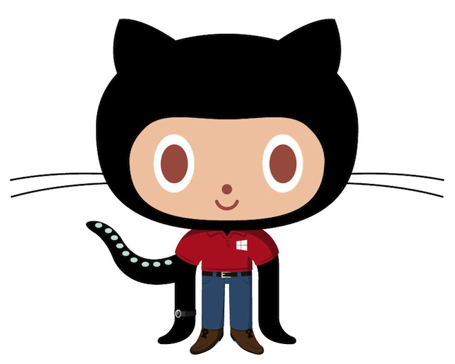

					        	Github Quick Resume
> [Visit Portofolio here](https://projets.neworldwebsites.fr/)
# Git Basics |
> git help &nbsp; word-about<br>
> git config --global user.name "gilius"<br>

* Git init
* Git add &nbsp;( save to git )
* Git add . &nbsp; ( track all )
* Git add &nbsp; *.txt  &nbsp; ( in whole directory )
* Git add &nbsp; ' *.txt ' &nbsp; ( in whole project )
* Git add &nbsp; css/ &nbsp; ( all inside css )
* Git reset HEAD filename &nbsp; ( untrack some )
* .gitignore &nbsp; ( liste ignored files or folder/ inside )
* Git rm '*.txt'
* Git rm --cached &nbsp; ( remove staged from git )
* Git status &nbsp; ( what changed since last commit + wich  branch )
* Git commit
* Git commit -m ' '
* Git commit -a -m ' ' &nbsp; ( -a add mettre * files en zone staged)

# Git Checkout
* Git log &nbsp; ( q -> logout )
* Git log --oneline &nbsp; ( liste commit en 1 ligne )
* q &nbsp; ( quit )
* Git checkout &nbsp; ( commit | master ) <br>
ls ( to see from wich file commit come )
* Git reset --hard commitID &nbsp; ( efface après selected commit )
* Git diff commitID_1  commitID_2  &nbsp; ( difference entre 2 commits )
* Git diff commitID_2 &nbsp; ( compare difference commitID_1 actuel avec autre commit )

Head &nbsp; 0 -> 0 -> 0 -> 0 &nbsp;Master
               
# Git Branch
* Git branch contact &nbsp; ( pour créer page contact.html ) 
* Git branch &nbsp; ( affichage des différentes branch ) <br>
-> contact <br>
-> master
* Git checkout contact &nbsp; ( switch vers la branch contact )
* Git merge --abort &nbsp; ( cancellation )
* Git merge contact &nbsp; ( depuis master FUSIONNE branch contact )
* Git branch -D contact &nbsp; ( Delete contact branch )<br><br>
* PS : pour créer une branch et directement checkout dessus : <br>
-> Git checkout -b contact &nbsp; ( -b &nbsp; === &nbsp; branch )<br>
-> Git add -i (interactif)<br>
-> Git add -p ( )


# Git Flow ( easy tool )

 4 branchs -> feature | develop | release  | master <br>

 feature -> quand feature finish then merge with develop<br>
 develop -> fusionne régulièrement entre master et release<br>
 release -> derniers correctifs de l'ensemble avant master<br>
 master -> finalité tout doit fonctionner

 5ème branche -> HOTFIX

Git init

* git flow init

Git branch <br>
  -> develop * <br>
  -> master

* git flow feature start MYFEATURE

Git branch <br>
  -> develop <br>
  -> master <br>
	-> feature/MYFEATURE *

PS : instead &nbsp; CTRL+V &nbsp; -> &nbsp; CTRL+SHIFT+INSERT

inside feature/index <br>
touch index.html
git add index.html
git commit -m 'creation fichier index.html'

* git flow feature finish MYFEATURE &nbsp; ( merge with develop )

Can add how many features u want<br>
when one is fully checked : 

* git flow release start index

Ici sert surtout tagger la version :

* Git tag 1.0

git tag <br>
-> 1.0 <br>

Now can be publish online :

* git flow release finish MYFEATURE 
* git push --tags

Ensuite si malgrès tout un beug online :

* git flow hotfix start VERSION master
* git flow hotflix finish VERSION

Qui corrigera aussi dans develop

# Git-Hub

> TRANSFERT

* git remote add origin https://github.your.repository.git
* git push origin master
* git fetch origin master
* git push origin master --force &nbsp; ( if no team ! )
* git pull origin master
* git diff HEAD
* git add .
* git diff --staged &nbsp; ( status for diff )
* git reset .

> INSIDE GITHUB

* Issues 
* change > #num 
* Pull request 

> GIT PAGES

* create branch gh-pages
* default branch gh-pages
* delete master branch
* settings your link page url
* git clone https://github/dir-to-clone.git 
* git pull origin gh-pages

___


							Markdown Editor
							
# Mackdown

* TITLES : 

````markdown
#      <h1> 
##     <h2> 
###    <h3>
###### <h6> 
````
* UL LI : 

````markdown
* Item 1
* Item 2
  * Item 2a
  * Item 2b
````
* Item 1
* Item 2
  * Item 2a
  * Item 2b

* IMAGES : 

````markdown

````


* LINK ( CTRL + K ) :

````markdown
http://github.com - automatic!

[GitHub](http://github.com)

Visit https://github.com

[Look Picture](Ape_skeletons.png)
````
http://github.com - automatic!

[GitHub](http://github.com)

Visit https://neworldwebsites.fr

[Look Picture](Ape_skeletons.png)


* TEXT STYLE :

````markdown
*This text will be italic*
_This will also be italic_

**This text will be bold**
__This will also be bold__

_You **can** combine them_

~~Text barré~~

`<tag>`
`comment`
Username @mentions
````
*This text will be italic*
_This will also be italic_

**This text will be bold**
__This will also be bold__

_You **can** combine them_

~~Text barré~~

`<tag>`

`comment`

* Blockquotes :

````markdown
> We're living the future so
> the present is our past.
````
> We're living the future so

> the present is our past.

* CODE :

\`\`\`\`javascript

````javascript( any language name )
function fancyAlert(arg) {
  if(arg) {
    $.facebox({div:'#foo'})
  }
} 
````
\`\`\`\` <br>

* TABLEAU :
 
````markdown
| First Header  | Second Header |
| ------------- | ------------- |
| Content Cell  | Content Cell  |
| Content Cell  | Content Cell  |
````

| First Header  | Second Header |
| ------------- | ------------- |
| Content Cell  | Content Cell  |
| Content Cell  | Content Cell  |

* TASK LISTS :

````markdown
- [x] Finish my changes
- [ ] Push my commits to GitHub
- [ ] Open a pull request
````

- [x] Finish my changes
- [ ] Push my commits to GitHub
- [ ] Open a pull request

* EMOJICODE :

````markdown
:thumbsup:
:-1:
:thumbsdown:
:ok_hand:
:punch:
:facepunch:
:fist:
:v:
:wave:
:hand:
:raised_hand:
:open_hands:
:point_up:
:point_down:
:point_left:
:point_right:
:raised_hands:
:pray:
:point_up_2:
:clap:
:muscle:
:metal:
:fu:
:runner:
:shipit:   
:sparkles: 
:camel:    
:boom:     
:key:      
:1234:     
:1st_place_medal:    
:muscle:   
````

:thumbsup:
:-1:
:thumbsdown:
:ok_hand:
:punch:
:facepunch:
:grinning:
:grin:
:sweat_smile:
:fist:
:v:
:wave:
:hand:
:raised_hand:
:open_hands:
:point_up:
:point_down:
:point_left:
:point_right:
:raised_hands:
:pray:
:point_up_2:
:clap:
:muscle:
:metal:
:fu:
:runner:
:shipit:   
:sparkles: 
:camel:    
:boom:     
:key:      
:1234:     
:1st_place_medal:     
:muscle:  

[Emojis-Collection](https://www.webpagefx.com/tools/emoji-cheat-sheet/)


